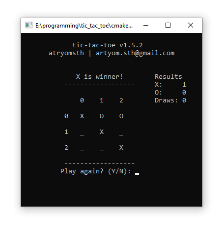

# tic_tac_toe

Features
---
- Protection against attempts to place a X/O in an already occupied cell
- Auto check for valid input (value outside the matrix, etc.))
- Ability to enter coordinates not only through the space between them, but almost any other character
- Changing the order of the move, depending on who won
- Beep at the end of the game

